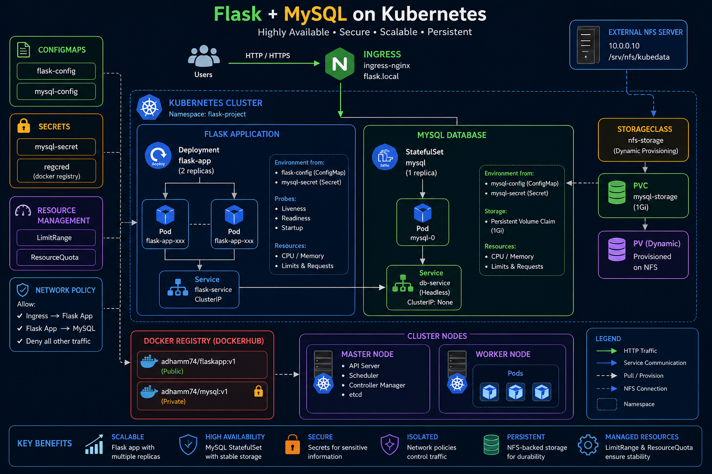
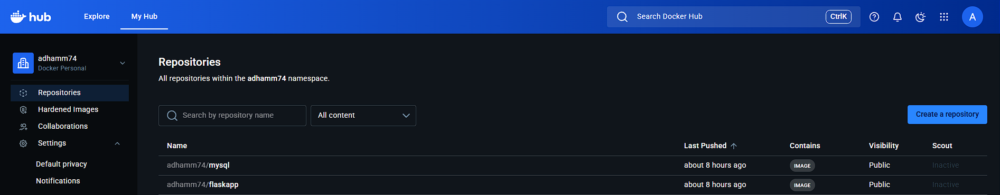
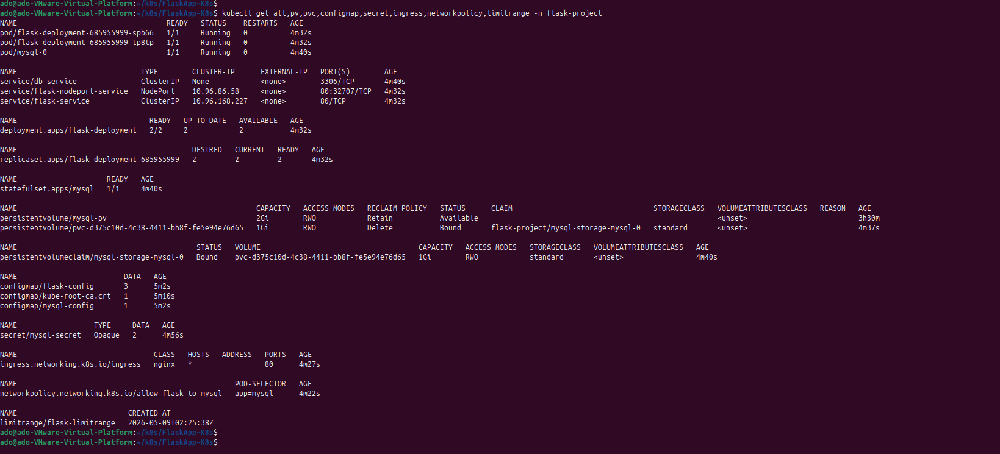
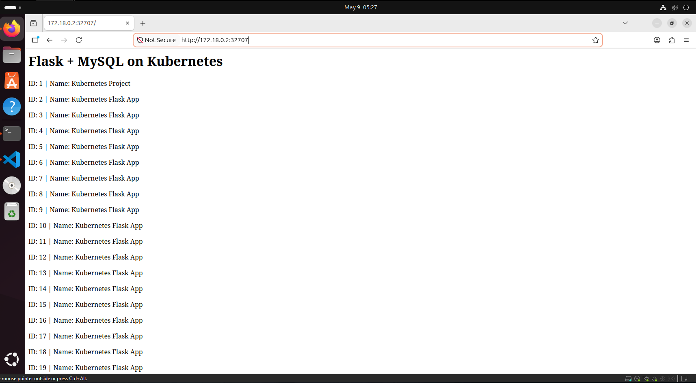

# Flask + MySQL on Kubernetes

A production-style Kubernetes project that deploys a Python Flask web application with a MySQL database backend using core Kubernetes resources.

---

# Project Overview



This project demonstrates how to deploy a scalable Flask application connected to a persistent MySQL database on Kubernetes.

The architecture includes:

- Flask Deployment with multiple replicas
- MySQL StatefulSet with persistent storage
- ConfigMaps for application configuration
- Secrets for sensitive information
- Persistent Volumes and Persistent Volume Claims
- Ingress Controller for external access
- Network Policies for secure communication
- Resource Limits and Resource Quotas
- DockerHub private repository integration using imagePullSecrets
- Optional NFS Dynamic Provisioning (Bonus)

---

# Architecture

## High-Level Architecture

```text
Users
   ↓
Ingress
   ↓
Flask Service (ClusterIP)
   ↓
Flask Deployment (2 replicas)
   ↓
MySQL Service (Headless)
   ↓
MySQL StatefulSet
   ↓
Persistent Storage
```

---

# Technologies Used

| Technology    | Purpose                    |
| ------------- | -------------------------- |
| Python Flask  | Web Application            |
| MySQL         | Database Backend           |
| Docker        | Containerization           |
| Kubernetes    | Container Orchestration    |
| k3s           | Kubernetes Cluster         |
| DockerHub     | Container Registry         |
| NGINX Ingress | HTTP Routing               |
| NFS           | Dynamic Persistent Storage |

---

# Kubernetes Resources Used

| Resource              | Purpose                      |
| --------------------- | ---------------------------- |
| Deployment            | Flask application deployment |
| StatefulSet           | Persistent MySQL deployment  |
| ConfigMap             | Environment configuration    |
| Secret                | Sensitive credentials        |
| PersistentVolume      | Persistent storage           |
| PersistentVolumeClaim | Storage request              |
| Service               | Internal networking          |
| Ingress               | External HTTP routing        |
| NetworkPolicy         | Secure communication         |
| LimitRange            | Default resource limits      |
| ResourceQuota         | Namespace resource control   |
| StorageClass          | Dynamic provisioning         |

---

# DockerHub Images

| Image                | Visibility |
| -------------------- | ---------- |
| adhamm74/flaskapp:v1 | Public     |
| adhamm74/mysql:v1    | Private    |

---

# Project Structure

```text
k8s-flask-mysql-project/
│
├── flaskapp/
│   ├── app.py
│   ├── requirements.txt
│   └── Dockerfile
│
├── database/
│   ├── Dockerfile
│   └── init.sql
│
├── k8s/
│   ├── namespace.yaml
│   │
│   ├── configmaps/
│   │   ├── flask-configmap.yaml
│   │   └── mysql-configmap.yaml
│   │
│   ├── secrets/
│   │   └── mysql-secret.yaml
│   │
│   ├── storage/
│   │   ├── pv.yaml
│   │   └── pvc.yaml
│   │
│   ├── database/
│   │   ├── mysql-service.yaml
│   │   └── mysql-statefulset.yaml
│   │
│   ├── flask/
│   │   ├── flask-deployment.yaml
│   │   ├── flask-service.yaml
│   │   └── flask-nodeport.yaml
│   │
│   ├──ingress.yaml
│   │
│   ├──network-policy.yaml
│   │
│   └──limit-range.yaml
│
│
└── README.md
```

---

# Prerequisites

Before starting, ensure the following tools are installed:

- Docker
- Kubernetes Cluster (k3s or kubeadm)
- kubectl
- DockerHub account
- Linux environment (Ubuntu recommended)

---

# Step 1 — Build Docker Images

## Build Flask Image

```bash
docker build -t adhamm74/flaskapp:v1 ./flaskapp
```

## Build MySQL Image

```bash
docker build -t adhamm74/mysql:v1 ./database
```

---

# Step 2 — Push Images to DockerHub

## Login to DockerHub

```bash
docker login
```

## Push Images

```bash
docker push adhamm74/flaskapp:v1

docker push adhamm74/mysql:v1

```

## Docker Images in DockerHub



---

# Step 3 — Kubernetes Cluster Setup

This project uses k3s Kubernetes.

## Install k3s Master Node

```bash
curl -sfL https://get.k3s.io | sh -
```

## Get Worker Join Token

```bash
sudo cat /var/lib/rancher/k3s/server/node-token
```

## Join Worker Node

```bash
curl -sfL https://get.k3s.io | K3S_URL=https://MASTER_IP:6443 K3S_TOKEN=TOKEN sh -
```

## Verify Cluster

```bash
kubectl get nodes
```

---

# Step 4 — Create Namespace

```bash
kubectl apply -f k8s/namespace.yaml
```

---

# Step 5 — Create Docker Registry Secret

This project uses a private DockerHub repository for the MySQL image.

```bash
kubectl create secret docker-registry regcred \
  --docker-server=https://index.docker.io/v1/ \
  --docker-username=DOCKER_USERNAME \
  --docker-password=DOCKER_PASSWORD \
  --docker-email=EMAIL
```

---

# Step 6 — Deploy Kubernetes Resources

Apply resources in the following order:

```bash

kubectl apply -f k8s/namespace.yaml

kubectl apply -f k8s/configmaps/

kubectl apply -f k8s/secrets/

kubectl apply -f k8s/storage/

kubectl apply -f k8s/database/

kubectl apply -f k8s/flask/

kubectl apply -f k8s/ingress.yaml

kubectl apply -f k8s/network-policy.yaml

kubectl apply -f k8s/limit-range.yaml
```

# All Running Kubernetes Resources



---

# Running App (Flask App)



---

# Environment Variables

## Flask Application

| Variable                | Value      |
| ----------------------- | ---------- |
| MYSQL_DATABASE_USER     | root       |
| MYSQL_DATABASE_PASSWORD | root       |
| MYSQL_DATABASE_DB       | BucketList |
| MYSQL_DATABASE_HOST     | db-service |

---

# Flask Deployment Features

The Flask Deployment includes:

- 2 replicas
- ConfigMap environment variables
- Secret integration
- Readiness probe
- Liveness probe
- Startup probe
- Resource requests and limits
- imagePullSecrets support

---

# MySQL StatefulSet Features

The MySQL StatefulSet includes:

- Persistent storage
- Stable pod identity
- Headless service
- Environment configuration via ConfigMap
- Secret-based root password
- Resource management
- Health checks

---

# Persistent Storage

## hostPath Storage

Used for local Kubernetes testing.

## Dynamic Provisioning with NFS (Bonus)

This project also supports:

- NFS Server
- StorageClass
- Dynamic PVC provisioning

---

# Ingress Configuration

Ingress is configured using ingress-nginx or Traefik.

Example host:

```text
flask.local
```

Add to local hosts file:

```bash
MASTER_IP flask.local
```

---

# Network Policy

The NetworkPolicy allows:

- Ingress → Flask Application
- Flask Application → MySQL Database

All other traffic is denied.

---

# Resource Management

## LimitRange

Defines default CPU and memory limits.

## ResourceQuota

Controls namespace resource consumption.

---

# Health Checks

## Liveness Probe

Restarts unhealthy containers.

## Readiness Probe

Ensures the application receives traffic only when ready.

## Startup Probe

Handles slow application startup.

---

# Verify Deployment

## Check Pods

```bash
kubectl get pods -n flask-project
```

## Check Services

```bash
kubectl get svc -n flask-project
```

## Check StatefulSets

```bash
kubectl get statefulsets -n flask-project
```

## Check Logs

```bash
kubectl logs POD_NAME -n flask-project
```

---

# Access Application

## Using NodePort

```text
http://NODE_IP:32707
```

## Using Ingress

```text
http://flask.local
```

---

# Security Features

- Kubernetes Secrets
- Private DockerHub repository
- imagePullSecrets
- Network Policies
- Namespace isolation

---

# Scalability Features

- Flask replicas
- Kubernetes self-healing
- Persistent storage
- Dynamic provisioning
- Resource control

---

# Troubleshooting

## ImagePullBackOff

Verify:

- DockerHub image exists
- Repository visibility
- imagePullSecrets configuration

## CrashLoopBackOff

Verify:

- MySQL pod is running
- Environment variables are correct
- Flask database retry logic

## PVC Pending

Verify:

- PersistentVolume exists
- StorageClass configuration
- NFS server accessibility

---

# Future Improvements

- Helm Chart
- CI/CD Pipeline
- Horizontal Pod Autoscaler
- Prometheus Monitoring
- Grafana Dashboards
- TLS/HTTPS with Cert-Manager

---

# Author

Adham Mohamed

DockerHub:

```text
https://hub.docker.com/u/adhamm74
```

---

# Conclusion

This project demonstrates a complete Kubernetes-based deployment of a Flask web application with a MySQL backend using production-style Kubernetes resources and best practices.

The implementation focuses on:

- Scalability
- Persistence
- Security
- Resource Management
- Service Discovery
- Dynamic Provisioning
- High Availability
